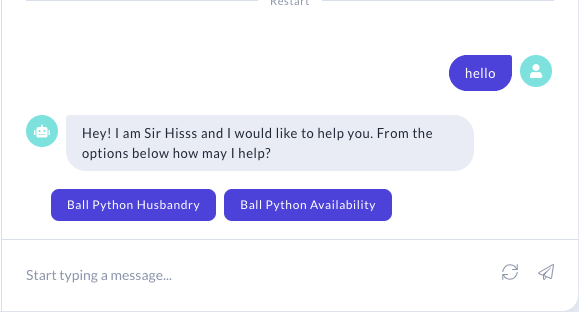
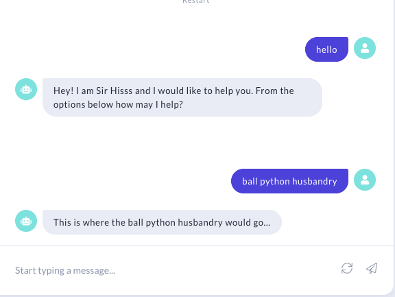

# serpentbot
A [Rasa](https://rasa.com/) chatbot for managing snake availability and answering basic questions about inventory, etc.

## Pre Reqs

`pip install -r requirements.txt`

You will need to install rasa x via `pip install rasa-x --extra-index-url https://pypi.rasa.com/simple`

## Train Bot
After running the commands above then you should be able to do

`rasa train` - To train the new model for the bot.

## Running Bot

You have 2 options you can use the `rasa shell` command to test the bot from the cli or follow the steps below to use Rasa X to have a GUI to interact with it.

Ensure you are in the `serpentbot` folder for all the below steps.

`rasa x` - This will open up a web browser and allow you to interact with the Bot UI.

## Persistence
When you run Rasa X locally, your training data and stories are read from the files in your project (e.g. data/nlu.md), and any changes you make in the UI are saved back to those files. Conversations and other data are stored in an SQLite database saved in a file called rasa.db.

## Screen Shots
This is just an example of some of the bot flow, it can run on Facebook, a Website and more

Ball Python Husbandry Story

